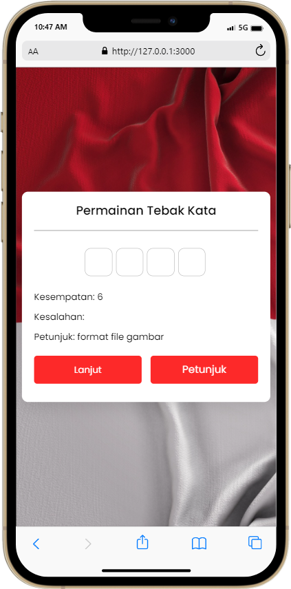

# Penjelasan Singkat Tentang Permainan Ini

### Permainan Tebak Kata
Pada project ini, saya membuat permainan ini untuk keperluan mengikuti lomba 17an yang diselenggarakan oleh @code.kyra x @vipcodestudio dan bekerja sama dengan WPU sebagai community partner. Saya membuat permainan ini menggunakan javascript. Permainan ini juga sudah responsif❗️

### Cara bermain
Saat permainan dimulai, kamu akan diberikan sebuah prompt kotak untuk menebak dan diberikan pilihan untuk memasukkan huruf sebanyak 5-8 kali. Untuk membantu kamu menebak kata, kamu dapat mengklik petunjuk untuk bantuan. Jika kamu benar atau salah, sebuah pesan akan ditampilkan. Jika kamu ingin mengubah kata apa pun, cukup klik Lanjutkan. 

# Screenshot
Berikut adalah screenshot project saya:

### Tampilan Dekstop:
 

### Tampilan Mobile:

# Akhir Kata
Dikembangkan oleh:
([@azharangga_kusuma](https://instagram.com/azharangga_kusuma))